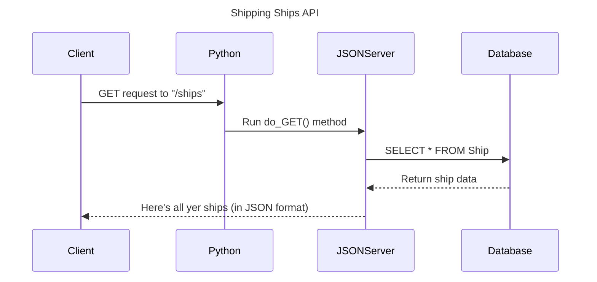

```mermaid
sequenceDiagram
    title Shipping Ships API

    participant Client
    participant Python
    participant JSONServer
    participant Database

    Client->>Python: GET request to "/ships"
    Python->>JSONServer: Run do_GET() method
    JSONServer->>Database: SELECT * FROM Ship
    Database-->>JSONServer: Return ship data
    %% JSONServer-->>Python: Send JSON response with ship data
    JSONServer-->>Client: Here's all yer ships (in JSON format)
    %% Python-->>Client: Send JSON response with ship data

```