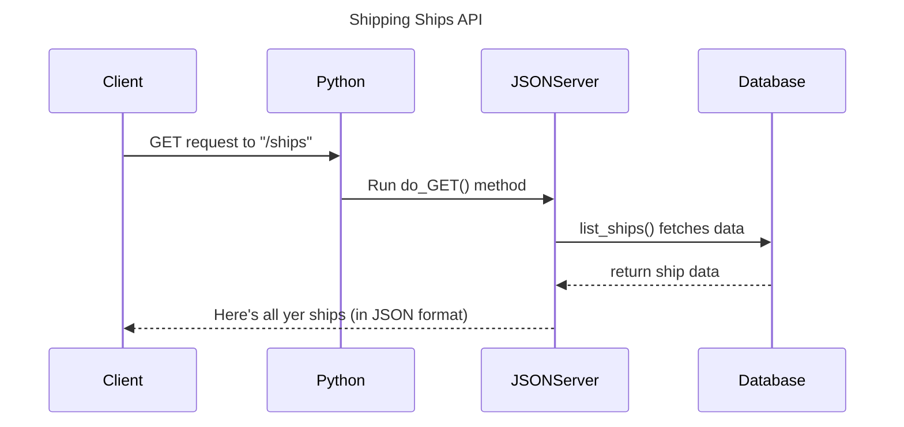

<!--- (HandleRequests parses the URL, determines which resource is being requested, and interacts with the Database to fetch the relevant data.)
-->

<!---
JSONServer->>Database: parse_url fetches data.

Correct Understanding:
The parse_url function only processes and returns the structured URL components so that your server can determine what resource is being requested (e.g., ships) and if any specific filtering (e.g., by ID) should be applied. 

The actual interaction with the database to fetch the ship data occurs in a different function, which, based on your code structure, would typically be in the list_ships() function or its equivalent.)
-->