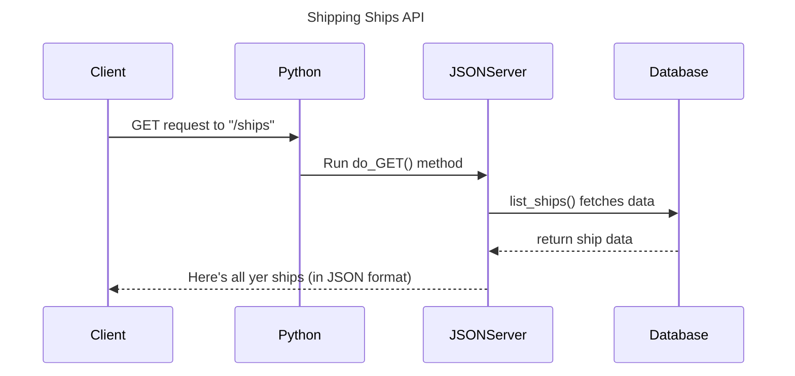

<!--- (HandleRequests parses the URL, determines which resource is being requested, and interacts with the Database to fetch the relevant data.)
-->

<!---
JSONServer->>Database: parse_url fetches data.

Correct Understanding:
The parse_url function only processes and returns the structured URL components so that your server can determine what resource is being requested (e.g., ships) and if any specific filtering (e.g., by ID) should be applied. 

The actual interaction with the database to fetch the ship data occurs in a different function, which, based on your code structure, would typically be in the list_ships() function or its equivalent.)
-->

<!---
    # def do_POST(self):
    #     """
    #     Handle POST requests from a client.
        
    #     This function is responsible for handling POST requests from a client.
    #     It takes the request's URL and determines the requested resource.
    #     If the requested resource is 'ships', 'docks', or 'haulers', it reads the request body,
    #     which should contain the data for the new ship, dock, or hauler, respectively.
    #     It then calls the appropriate function to create the new resource in the database.
    #     Finally, it returns a response with the newly created resource's data.

    #     If the requested resource is not one of the three allowed types, it returns a 'Not found' error.
    #     """

    #     # Parse the URL and get the resource
    #     url = self.parse_url(self.path)

    #     # Check if the requested resource is 'ships'
    #     if url["requested_resource"] == "ships":
    #         # Read the request body and parse it as JSON
    #         request_body = json.loads(self.rfile.read(int(self.headers.get('content-length', 0))))
    #         # Create a new ship using the request body
    #         response_body = create_ship(request_body)
    #         # Return a response with the new ship's data, indicating success
    #         return self.response(response_body, status.HTTP_201_SUCCESS_CREATED.value)

    #     # Check if the requested resource is 'docks'
    #     elif url["requested_resource"] == "docks":
    #         # Read the request body and parse it as JSON
    #         request_body = json.loads(self.rfile.read(int(self.headers.get('content-length', 0))))
    #         # Create a new dock using the request body
    #         response_body = create_dock(request_body)
    #         # Return a response with the new dock's data, indicating success
    #         return self.response(response_body, status.HTTP_201_SUCCESS_CREATED.value)

    #     # Check if the requested resource is 'haulers'
    #     elif url["requested_resource"] == "haulers":
    #         # Read the request body and parse it as JSON
    #         request_body = json.loads(self.rfile.read(int(self.headers.get('content-length', 0))))
    #         # Create a new hauler using the request body
    #         response_body = create_hauler(request_body)
    #         # Return a response with the new hauler's data, indicating success
    #         return self.response(response_body, status.HTTP_201_SUCCESS_CREATED.value)

    #     # If the requested resource is not one of the three allowed types, return a 'Not found' error
    #     else:
    #         return self.response("Not found", status.HTTP_404_CLIENT_ERROR_RESOURCE_NOT_FOUND.value)
--->